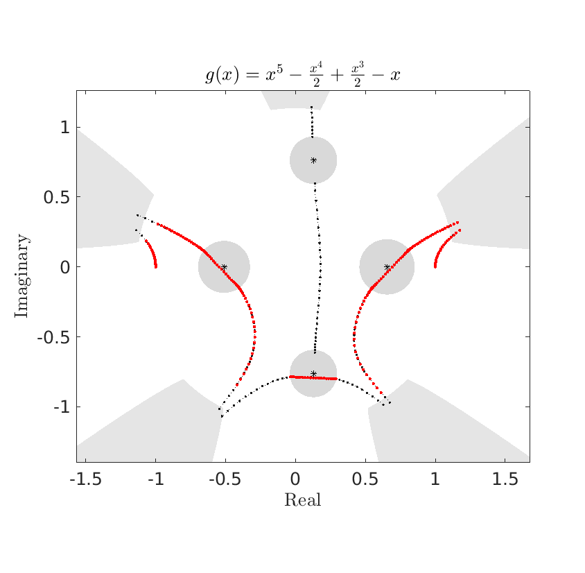
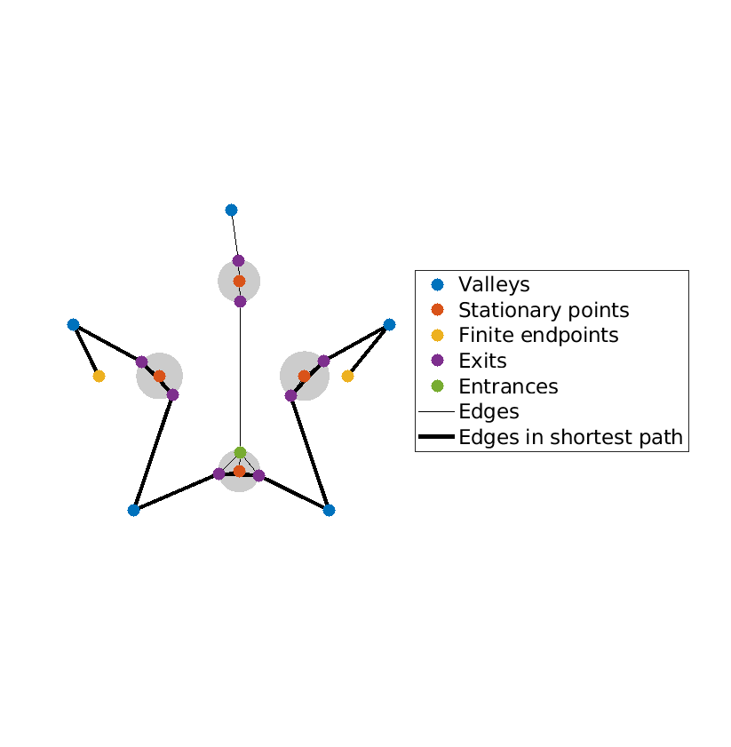
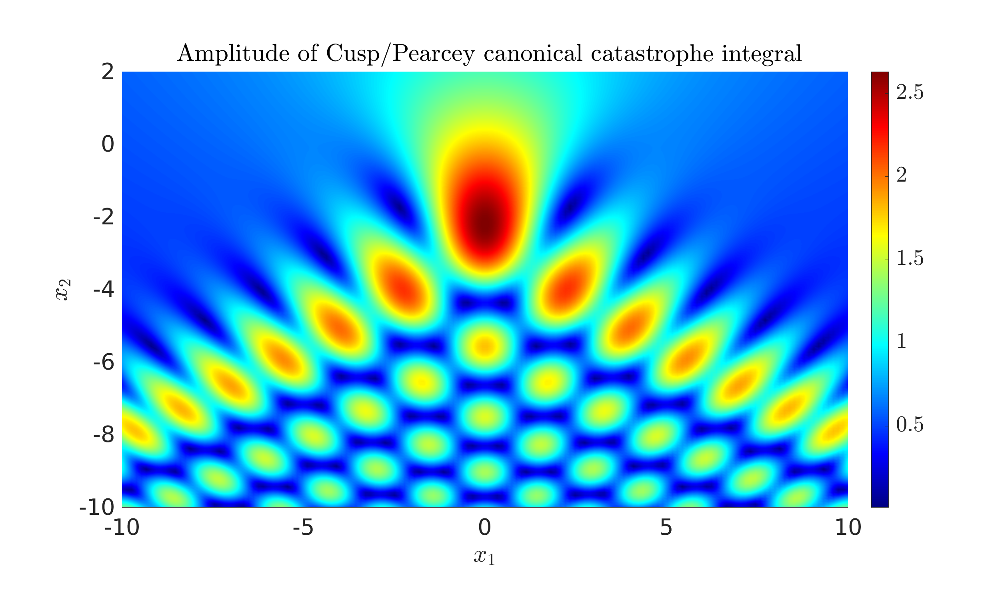
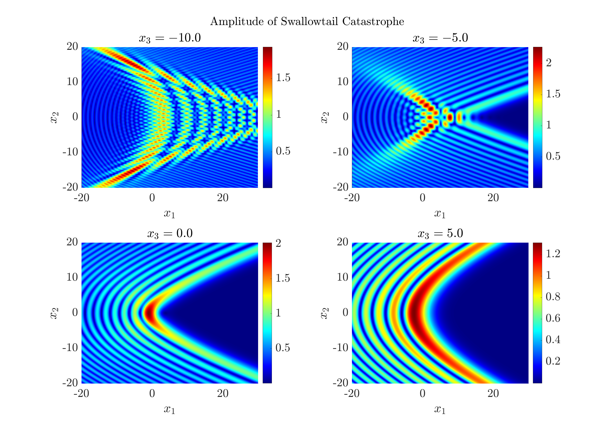

# PathFinder

[](https://github.com/AndrewGibbs/PathFinder/actions/workflows/CI.yml)
[](https://codecov.io/github/AndrewGibbs/PathFinder)

PathFinder is a Matlab/Octave toolbox for the numerical evaluation of highly oscillatory integrals. Specifically, PathFinder can efficiently evaluate integrals of the form

$$
I = \int_{a}^b f(z)\exp(\mathrm{i}\omega g(z)) \mathrm{d}z,\tag{1}
$$

where $g$ is a polynomial, $f$ is entire (analytic everywhere in $\mathbb{C}$), $\omega>0$ is a frequency parameter, and the endpoints $a$ and $b$ may be finite or infinite. Further, it is assumed that $I$ is a convergent integral and that $|f(z)|$ grows sub-exponentially as $|z|\to\infty$.

PathFinder is based on steepest descent contour deformation, but it can be easily used without a deep understanding of the underlying mathematics; it is sufficient to understand the conditions in the previous paragraph. This document intends to provide a full explanation of **how to use PathFinder**, without giving details of the mathematical processes going on beneath. If you would like to understand how it all works, full details of the algorithm can be found in [[1]](#references), with some additional information in the 'extra_notes' subfolder. Alternatively, a brief overview can be found [below](#the-idea-behind-the-numerical-steepest-descent-nsd-method-and-pathfinder).

## Contents of README
* [Setup and installation](#setup-and-installation)
* [Using PathFinder](#using-pathfinder)
* [Examples](#examples)
* [Advanced usage](#advanced-usage)
* [The idea behind the Numerical Steepest Descent (NSD) method and PathFinder](#the-idea-behind-the-numerical-steepest-descent-nsd-method-and-pathfinder)

## Setup and installation

After downloading the source code from GitHub, open Matlab/Octave and navigate to the PathFinder folder. Then run ```addPaths.m``` to add all necessary paths to the Matlab search path.

The more computationally expensive parts of PathFinder have been written in C, to compile as MEX functions (Matlab executable). Compile the MEX codes for your system by running ```compileAll.m```. This works with Octave or Matlab. and only needs to be done once for each.

If there are any compilation issues:
* Please raise an issue on the GitHub issues page, stating your Matlab/Octave version and operating system.
* Set the optional argument `'use mex'` to `false` in future PathFinder calls to avoid the use of MEX functions. More information about how to provide optional arguments is given below.

To test the code works, try running
```matlab
PathFinder(-1, 1, @(x) sin(x), [1 0 0], 100, 10, 'plot')
```
This approximates the integral

$$
\int_{-1}^1\sin(x)\exp(\mathrm{i}100x^2)\mathrm{d}x=0,
$$

and will produce a simple plot of the contour deformation.

You could also try running the codes in the 'examples' subfolder.

## Using PathFinder

### Syntax for finite endpoints

When $a$ and $b$ are finite:
```matlab
I = PathFinder(a, b, f, polyCoeffs, freq, numPts);
 ```
 Referring to the integral (1):
 * `a` and `b` correspond to endpoints $a$ and $b$. For now, we assume that they are finite - the syntax changes slightly when they are infinite.
 * `f` is a **vectorised** function handle representing the function $f(z)$
 * `polyCoeffs` are the coefficients of the phase function $g(z)$

### Extracting the underlying quadrature rule

Most of the PathFiner algorithm is spent constructing a quadrature rule. For some applications, you may want to reuse the same quadrature rule for multiple functions $f$. In this case, it is useful to compute the weights and nodes just once and store them, so they can be reused.

To access the quadrature weights and nodes, a different routine can be called, with almost the same inputs:
```matlab
 [z, w] = PathFinderQuad(a, b, polyCoeffs, freq, numPts);
 ```

 All optional inputs described throughout this document can be used in `PathFinderQuad`.
 ### Syntax for infinite endpoints

 Here we use the optional input `infcontour`, followed by a boolean vector of two entries. If true, this tells PathFinder that the first and/or second inputs, respectively $a$ and/or $b$, are infinite.

For example, if $a=\exp(\mathrm{i}\theta)\infty$, and $b\in\mathbb{C}$ is finite, use the following:
 ```matlab
 PathFinder(theta, b, f, poly_coeffs, freq, num_pts,'infcontour', [true false])
 ```

Suppose that $a$ and/or $b$ are infinite, but not exactly in a complex valley, in the sense of [[1]](#references). PathFinder checks if Jordan's lemma can be applied, justifying a rotation of the infinite endpoint to the valley.

For example, the integral
$$
\int_{-\infty}^{\infty}\exp(\mathrm{i}\omega x^2)\mathrm{d} x = \frac{(\mathrm{i}+1)\sqrt\pi}{\sqrt{2\omega}}
$$
has endpoints at $\pm\infty$; these are not strictly valleys, but the integral is convergent. The true valleys are at $\{5\pi/4,\pi/4\}$. This is not an issue in practice, as PathFinder will return the same value for
```matlab
PathFinder(pi,0,[],[1 0 0],100,10,'infcontour',[true true])
```
and
```matlab
PathFinder(5*pi/4,pi/4,[],[1 0 0],100,10,'infcontour',[true true])
```

However, if the infinite endpoints are in a sector of the complex plane where the integrand grows exponentially, the integral does not converge, and PathFinder will return an error.

### A note about the frequency parameter

An integral may be highly oscillatory for a frequency parameter $\omega=1$ if the coefficients of $g$ are large. Similarly, if one multiplies $\omega$ by some constant $C>0$ and divides $g$ by the same constant $C$, the integral (1) remains unchanged, and PathFinder will produce identical results.

It is also worth noting that PathFinder is useful for many low-frequency integrals over unbounded complex contours. These can be problematic when approximating from scratch, even when 'brute force' numerical methods are used, as care must be taken to avoid regions where the integrand is growing exponentially.

### Plotting

 It can be interesting to see the contour deformation being performed by PathFinder. Some understanding of the underlying mathematics is required to correctly interpret these plots, but in any case, they usually look quite nice. On the other hand, if you are trying to learn how PathFnder works, these plots can be a useful way to do that.

 To produce a plot of the steepest descent deformation, use the optional input `'plot'`. For example:
```matlab
PathFinderQuad(a, b, f, poly_coeffs, freq, num_pts, 'plot')
 ```
 For example, the code
 ```matlab
PathFinder(-1, 1, [], [1 -0.5 0.5 0 -1 0], 50, 25, 'plot');
 ```
 produces the following plot:
 
 Here's a breakdown of the components:
 * The contour approximations are in black.
 * The balls are in grey
 * The valleys are in grey 
 * The quadrature points are in red
 * The stationary points are black stars

 To produce the graph representation of the contour deformation, use
```matlab
 PathFinder(a, b, f, poly_coeffs, freq, num_pts,'plot graph')
 ```
For example, the code
 ```matlab
PathFinder(-1, 1, [], [1 -0.5 0.5 0 -1 0], 50, 25, 'plot graph');
 ```
 produces the following graph:
 

 Further examples of plots can be found in the 'examples' subfolder, and in [1](references).

## Examples

In the 'examples' subfolder, we provide sample codes using PathFinder. These are summarised below:

* `plotEGs.m` produces the contour deformation plot and graph shown above.
* `stdComparison.m` is an example where the phase $g$ has coefficients based on the digits of $\pi$. First, the contour deformation is plotted for a range of $\omega$, to demonstrate how this is affected by frequency (in contrast to standard steepest descent approaches). Second, the performance of PathFinder is compared to Matlab/Octave's `integral` routine. The digits of agreement and CPU time are compared.
* `airyApprox` uses PathFinder to approximate the Airy function of the first and second kind, based on the integral representation [[2, 9.5.4-9.5.5]](#references). First, this approximation is validated against the Matlab/Octave routine `airy`. Second, PathFinder's contour deformation is plotted for a range of input arguments, showing different topological behaviour.
* `cuspCatastrophe.m` produces a plot of the Pearcey/Cusp canonical Catastrophe integral [[2, 36.2.4]](#references). This is an interesting application of PathFinder, as each point in $\mathbb{R}^2$ corresponds to a different phase function.
* `swallowtailCatastrophe.m` produces various slice plots of the Swallowtail Catastrophe integral [[2, 36.2.4]](#references). Now each point in $\mathbb{R}^3$ corresponds to a different phase function.

<figure>
  
  <figcaption>PathFinder Approximation to Pearcey/Cusp Catastrophe, produced by  cuspCatastrophe.m</figcaption>
</figure>

<figure>
   
  <figcaption>PathFinder Approximation to Swallowtail Catastrophe, produced by  swallowtailCatastrophe.m</figcaption>
</figure>

## Advanced usage
 
 ### Adjustable parameters

The optional inputs `'plot'`, `'plot graph'` and `'infcontour'` are just three of many adjustable parameters. In fact, all of the algorithm parameters defined in [1, Table 4.1](#references) can be easily modified, if the user wishes to do so. Here is a list of adjustable parameters - each can be adjusted by adding the optional input as a text string, followed by the new value.

|  Parameter |  Meaning |  Default | 
|---|---|---|
|  ```C_ball``` | Governs maximum number of oscillations across each non-oscillatory ball (and hence the ball radius)  |  $2\pi$ |
```N_ball```| Number of rays used when determining the ball radius |  16 |
|```delta_ball```|  Governs when overlapping balls should be amalgamated |  $10^{-3}/(2\max(J-2,1))$, where $J$ is the degree of the polynomial $g$ | 
```delta_ODE```|  Governs the local step size in the ODE solver for SD path tracing | $10^{-1}$ | 
```delta_coarse```|  Tolerance for the increment in the Newton iteration in the SD path tracing | $10^{-2}$   | 
```delta_fine```|  Tolerance for the increment in the Newton iteration in the quadrature | $10^{-13}$  | 
```delta_quad```|  Governs when the contribution from an integral on the quasi-SD deformation is computed | $10^{-16}$  | 
```inf quad rule```|  Determines which quadrature rule is used for the SD contours, from a choice of Gauss-Laguerre ```'laguerre'```, or truncated Gauss-Legendre ```'legendre'``` |  ```'laguerre'``` |
`use mex` | Determines if the MEX codes are to be used for higher performance. Should only be turned off if there is some issue with the MEX compiler, as described above.| `true` |

### Creating a log file

There is also the option to record information about the algorithm at each step. This can be achieved by adding the optional input `'log'`. A log file is then generated, and the name is based on the time and date that the file was created. For example:
```matlab
PathFinder(-1, 1, @(x) x.^2, [1 -0.5 0.5 0 -1 0], 50, 10, 'log');
```


If you want to name it something different, use the option `'log name'` followed by a text string argument with the desired name. For example:
```matlab
PathFinder(-1, 1, @(x) x.^2, [1 -0.5 0.5 0 -1 0], 50, 10, 'log name','el_murad');
```

### Hard-coded quadrature

For efficiency, PathFinder uses hard-coded Gaussian quadrature to evaluate contour integrals. By default, these hard-coded values have been stored for up to 100 points each in the subroutines `src/gauss_quadrature_rules/gausLagHC.m` and `src/gauss_quadrature_rules/gausLegHC.m`, corresponding to Gauss-Laguerre and Gauss-Legendre respectively.

If more points are requested by PathFinder, these are generated from scratch using the Golub-Welsch algorithm, with code supplied by Dirk Laurie (22/6/1998); later edited by Walter Gautschi (4/4/2002).

If desired, you can increase the number of hard-coded points, overwriting the subroutines `gausLagHC` and `gausLegHC`. To do this:
* Change the working directory to `src/gauss_quadrature_rules`
* Open the script(s) `hardCodeQuadratureGaulag` and/or `hardCodeQuadratureGauleg` as required
* Adjust the parameter `maxNumHardCodedPts` as required, and run the script.

## The idea behind the Numerical Steepest Descent (NSD) method and PathFinder

PathFinder is designed to be used by non-experts, who do not understand how it works. But if you'd like a brief explanation of what's going on underneath - here we briefly outline how PathFinder works.

Steepest descent contours are directed complex contours, along which $\Re g$ is constant and $\Im g$ is strictly increasing. This corresponds to zero oscillation and exponential decay of the integrand. Compared with oscillatory integrals, exponentially decaying integrals are much easier to evaluate numerically. The idea behind the Numerical Steepest Descent is to deform the original contour (from $a$ to $b$) onto a series of steepest descent contours. Typically these pass through stationary points of $g$, that is $\xi$ where $g'(\xi)=0$. The value of $I[f]$ will remain the same after this deformation, by Cauchy's Theorem. In principle, one can then apply suitable numerical quadrature rules to evaluate the contributions from the steepest descent contours. However, in practice, determining the steepest descent deformation for a given phase function can be complicated, and standard numerical quadrature rules may be inaccurate when multiple coalescing stationary points are present. PathFinder solves both these difficulties, by automating the deformation process and enclosing stationary points in a "non-oscillatory region" in which the integrand undergoes at most a bounded number of oscillations, and in which we do not attempt to trace or integrate along steepest descent contours. 

* Away from stationary points, PathFinder constructs steepest descent contours using an ODE solver combined with a Newton correction.
* Close to stationary points, where the integrand is non-oscillatory, PathFinder connects the endpoints of different steepest descent contours using straight line contours.
* The contours obtained are used to build a graph, the shortest path through which (connecting the endpoints $a$ and $b$) is chosen via Dijkstra's algorithm. This step uses the code [[3]](#references).
* Quadrature points are allocated along the contours in the shortest path (Gauss-Legendre for the straight-line contours near the stationary points and Gauss-Laguerre for the steepest descent contours).

## Acknowledgments

I am very grateful for the guidance and advice of Daan Huybrechs and David Hewett throughout the development of this software. I am also grateful for financial support from KU Leuven project C14/15/05 and EPSRC projects EP/S01375X/1, EP/V053868/.

Some of the code in PathFinder relies on other projects. I am grateful to Dimas Aryo whose code is used for the Dijkstra shortest path algorithm. Copyright information for this code can be found in: `src/shortest_path/dijkstra/license.txt`. I am also grateful to Dirk Laurie and Walter Gautschi for writing the Golub-Welsch algorithm used to generate Gaussian quadrature rules. 

## References
* [1] <a href="https://www.sciencedirect.com/science/article/pii/S0021999124000366/pdfft?md5=f86304d6eaa58530f9316f273896d3b0&pid=1-s2.0-S0021999124000366-main.pdf" target="_blank">Numerical evaluation of oscillatory integrals via automated steepest descent contour deformation, _A. Gibbs, D. P. Hewett, D. Huybrechs_, J. Comput. Phys. 501 (2024)</a>

* [2] <a href="https://dlmf.nist.gov/" target="_blank">Digital Library of Mathematical Functions, release 1.1.12 of 2023-12-15.</a>

* [3] [Dimas Aryo (2024). Dijkstra Algorithm, MATLAB Central File Exchange. Retrieved January 12, 2024.](https://www.mathworks.com/matlabcentral/fileexchange/36140-dijkstra-algorithm)