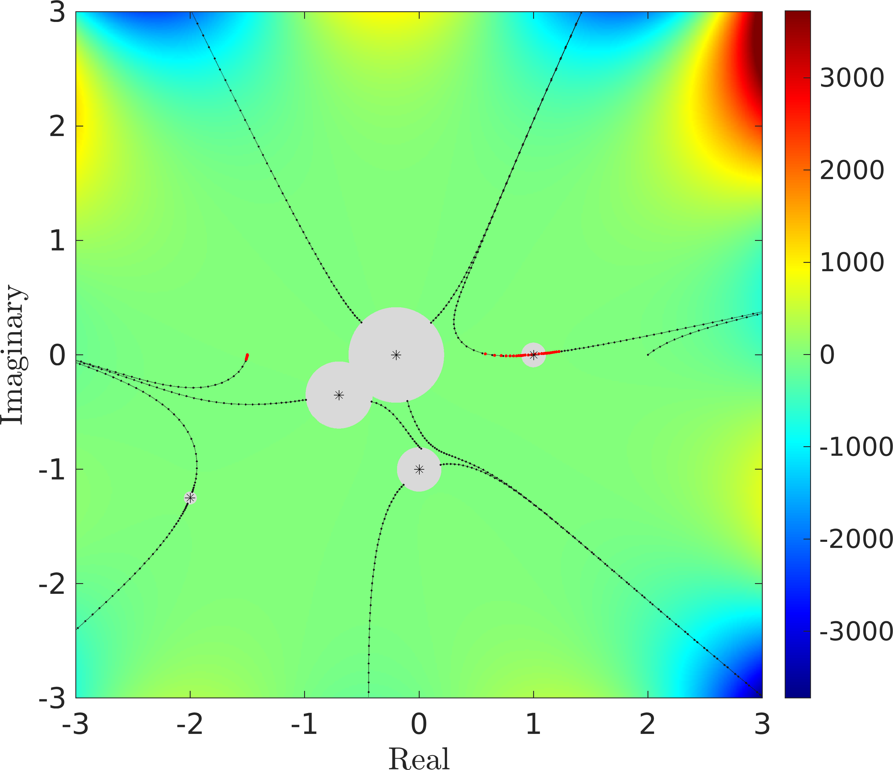

# PathFinder

PathFinder is a Matlab toolbox for the numerical evaluation of highly oscillatory integrals.

Currently, PathFinder can evaluate one-dimensional integrals where the phase is a polynomial.

PathFinder is based on automated steepest descent contour deformation, combined with Gauss quadrature. Full details of the algorithm, along with examples, can be found in [[1]](#references).

## Integrals which can be approximated by PathFinder

PathFinder can approximate integrals of the form:

$$
I = \int_{a}^b f(z)\exp(\mathrm{i}\omega g(z)) \mathrm{d}z,
$$

where $g$ is a polynomial, $f$ is analytic, $\omega>0$ is a frequency parameter, and the endpoints $a$ and $b$ may be finite or infinite (at a complex valley).

It is assumed that $f$ doesn't grow too fast, and that the integral $I$ converges.

## The idea behind the Numerical Steepest Descent (NSD) method and PathFinder

Steepest descent contours are directed complex contours, along which $\Re g$ is constant and $\Im g$ is strictly increasing. This corresponds to zero oscillation and exponential decay of the integrand. Compared with oscillatory integrals, exponentially decaying integrals are much easier to evaluate numerically. The idea behind the Numerical Steepest Descent is to deform the original contour (from $a$ to $b$) onto a series of steepest descent contours. Typically these pass through stationary points of $g$, that is $\xi$ where $g'(\xi)=0$. The value of $I[f]$ will remain the same after this deformation, by Cauchy's Theorem. In principle one can then apply suitable numerical quadrature rules to evaluate the contributions from the steepest descent contours. However, in practice, determining the steepest descent deformation for a given phase function can be complicated, and standard numerical quadrature rules may be inaccurate when multiple coalescing stationary points are present. PathFinder solves both these difficulties, by automating the deformation process and enclosing stationary points in a "non-oscillatory region" in which the integrand undergoes at most a bounded number of oscillations, and in which we do not attempt to trace or integrate along steepest descent contours. 

* Away from stationary points, PathFinder constructs steepest descent contours using an ODE solver combined with a Newton correction.
* Close to stationary points, where the integrand is non-oscillatory, PathFinder connects the endpoints of different steepest descent contours using straight line contours.
* The contours obtained are used to build a graph, the shortest path through which (connecting the endpoints $a$ and $b$) is chosen via Dijkstra's algorithm.
* Quadrature points are allocated along the contours in the shortest path (Gauss-Legendre for the straight-line contours near the stationary points and Gauss-Laguerre for the steepest descent contours). 



## Setup

After downloading the source code from GitHub, open Matlab and navigate to the PathFinder folder. Then run ```addPaths.m``` to add all necessary paths to the Matlab search path.

To test the code works, try running
```matlab
PathFinder(-1,1,@(x) sin(x),[2 0 0],100,10,'plot')
```
This approximates the integral

$$
\int_{-1}^1\sin(x)\exp(\mathrm{i}100x^2)\mathrm{d}x=0,
$$

and will produce a simple plot of the contour deformation. 

PathFinder uses MEX codes to improve performance. MEX codes for Windows, Mac and Linux operating systems are provided in the src/MEXcompilation folder, and if the appropriate MEX files are compatible with your operating system then they should run without problems. However, if the above test fails and you get an error message like "```Unrecognized function or variable 'get_smallest_supset_ball_mex'```" then you will need to run ```compile_all.m``` to produce MEX code optimised for your operating system. For this you need to have the Matlab Coder package installed.

If you encounter problems, please raise an issue and we will try to help!

## Usage

Typical syntax, when a and b are finite, and f is a matlab function handle:
```matlab
I = PathFinder(a, b,f, poly_coeffs, freq, num_pts)
 ```
To access the quadrature weights and nodes:
```matlab
 [z,w] = PathFinderQuad(a, b, poly_coeffs, freq, num_pts);
 ```
 ### Allowing $a$ and/or $b$ to be infinite
 If, for example, $a=\exp(\mathrm{i}\theta)\infty$, and $b\in\mathbb{C}$ is finite, use the following:
 ```matlab
 PathFinder(theta, b, f, poly_coeffs, freq, num_pts,'inf contour', [true false])
 ```

 ### Plotting
 To produce a plot of the steepest descent deformation (similar to the one above, without the colouring), use
```matlab
PathFinderQuad(a, b, f, poly_coeffs, freq, num_pts,'plot')
 ```
 To produce the graph of the deformation, use
```matlab
 PathFinder(a, b, f, poly_coeffs, freq, num_pts,'plot')
 ```

 Further examples can be found in [1].
 ## Adjustable parameters

In a similar sytax to the ```'inf contour'``` is an optional input, many of the parameters in the PathFinder algorithm are adjustable. Details of what each parameter does can be found in [1].

|  Parameter |  Meaning |  Default | 
|---|---|---|
|  ```C_ball``` | Governs maximum number of oscillations across each non-oscillatory ball (and hence the ball radius)  |  $2\pi$ |
```N_ball```| Number of rays used when determining the ball radius |  16 |
|```delta_ball```|  Governs when overlapping balls should be amalgamated |  $10^{-3}/(2\max(J-2,1))$, where $J$ is the degree of the polynomial $g$ | 
```delta_ODE```|  Governs the local step size in the ODE solver for SD path tracing | $10^{-1}$ | 
```delta_coarse```|  Tolerance for the increment in the Newton iteration in the SD path tracing | $10^{-2}$   | 
```delta_fine```|  Tolerance for the increment in the Newton iteration in the quadrature | $10^{-13}$  | 
```delta_quad```|  Governs when the contribution from an integral on the quasi-SD deformation is computed | $10^{-16}$  | 
```inf quad rule```|  Determines which quadrature rule is used for the SD contours, from a choice of Gauss-Laguerre ```'laguerre'```, or truncated Gauss-Legendre ```'legendre'``` |  ```'laguerre'``` | 

# References
[1] [Numerical evaluation of oscillatory integrals via automated steepest descent contour deformation, _A. Gibbs, D. P. Hewett, D. Huybrechs_, 2023](https://arxiv.org/abs/2307.07261)
