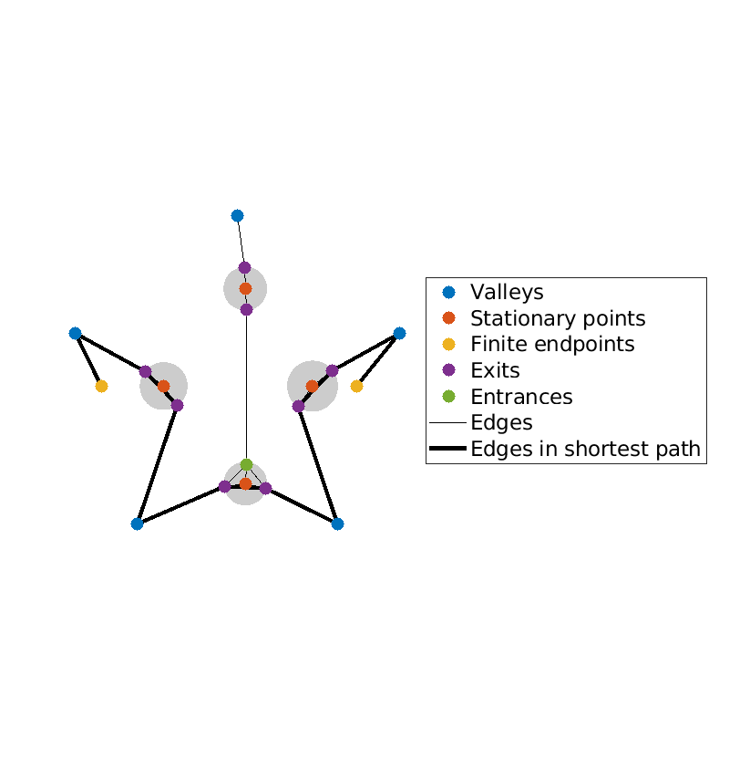

# Basic use

## Syntax for finite endpoints

When $a$ and $b$ are finite:
```matlab
I = PathFinder(a, b, f, polyCoeffs, freq, numPts);
 ```
 Referring to the integral ($I$)[../intro.md]:
 * `a` and `b` correspond to endpoints $a$ and $b$. For now, we assume that they are finite - the syntax changes slightly when they are infinite.
 * `f` is a **vectorised** function handle representing the function $f(z)$
 * `polyCoeffs` are the coefficients of the phase function $g(z)$

## Extracting the underlying quadrature rule

Most of the PathFiner algorithm is spent constructing a quadrature rule. For some applications, you may want to reuse the same quadrature rule for multiple functions $f$. In this case, it is useful to compute the weights and nodes just once and store them, so they can be reused.

To access the quadrature weights and nodes, a different routine can be called, with almost the same inputs:
```matlab
 [z, w] = PathFinderQuad(a, b, polyCoeffs, freq, numPts);
 ```

 All optional inputs described throughout this document can be used in `PathFinderQuad`.
 ## Syntax for infinite endpoints

 Here we use the optional input `infcontour`, followed by a boolean vector of two entries. If true, this tells PathFinder that the first and/or second inputs, respectively $a$ and/or $b$, are infinite.

For example, if $a=\exp(\mathrm{i}\theta)\infty$, and $b\in\mathbb{C}$ is finite, use the following:
 ```matlab
 PathFinder(theta, b, f, poly_coeffs, freq, num_pts,'infcontour', [true false])
 ```

Suppose that $a$ and/or $b$ are infinite, but not exactly in a complex valley, in the sense of {cite:p}'PFpaper'. PathFinder checks if Jordan's lemma can be applied, justifying a rotation of the infinite endpoint to the valley.

For example, the integral

$$
\int_{-\infty}^{\infty}\exp(\mathrm{i}\omega x^2)\mathrm{d} x = \frac{(\mathrm{i}+1)\sqrt\pi}{\sqrt{2\omega}}
$$

has endpoints at $\pm\infty$; these are not strictly valleys, but the integral is convergent. The true valleys are at $\{5\pi/4,\pi/4\}$. This is not an issue in practice, as PathFinder will return the same value for
```matlab
PathFinder(pi,0,[],[1 0 0],100,10,'infcontour',[true true])
```
and
```matlab
PathFinder(5*pi/4,pi/4,[],[1 0 0],100,10,'infcontour',[true true])
```

However, if the infinite endpoints are in a sector of the complex plane where the integrand grows exponentially, the integral does not converge, and PathFinder will return an error.

### A note about the frequency parameter

An integral may be highly oscillatory for a frequency parameter $\omega=1$ if the coefficients of $g$ are large. Similarly, if one multiplies $\omega$ by some constant $C>0$ and divides $g$ by the same constant $C$, the integral (1) remains unchanged, and PathFinder will produce identical results.

It is also worth noting that PathFinder is useful for many low-frequency integrals over unbounded complex contours. These can be problematic when approximating from scratch, even when 'brute force' numerical methods are used, as care must be taken to avoid regions where the integrand is growing exponentially.

### Plotting

 It can be interesting to see the contour deformation being performed by PathFinder. Some understanding of the underlying mathematics is required to correctly interpret these plots, but in any case, they usually look quite nice. On the other hand, if you are trying to learn how PathFnder works, these plots can be a useful way to do that.

 To produce a plot of the steepest descent deformation, use the optional input `'plot'`. For example:
```matlab
PathFinderQuad(a, b, f, poly_coeffs, freq, num_pts, 'plot')
 ```
 For example, the code
 ```matlab
PathFinder(-1, 1, [], [1 -0.5 0.5 0 -1 0], 50, 25, 'plot');
 ```
 produces the following plot:
 
 Here's a breakdown of the components:
 * The contour approximations are in black.
 * The balls are in grey
 * The valleys are in grey 
 * The quadrature points are in red
 * The stationary points are black stars

 To produce the graph representation of the contour deformation, use
```matlab
 PathFinder(a, b, f, poly_coeffs, freq, num_pts,'plot graph')
 ```
For example, the code
 ```matlab
PathFinder(-1, 1, [], [1 -0.5 0.5 0 -1 0], 50, 25, 'plot graph');
 ```
 produces the following graph:
 

 Further examples of plots can be found in the 'examples' subfolder, and in {cite:p}`PFpaper`, and more recently in {cite:p}`wm:24`.