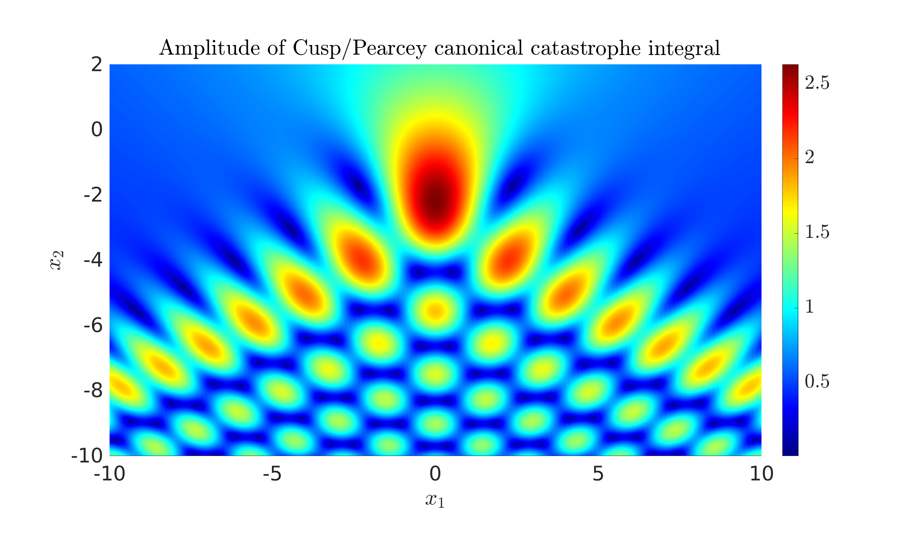

# Examples

In the 'examples' subfolder, we provide sample codes using PathFinder. These are summarised below:

* `plotEGs.m` produces the contour deformation plot and graph shown above.
* `stdComparison.m` is an example where the phase $g$ has coefficients based on the digits of $\pi$. First, the contour deformation is plotted for a range of $\omega$, to demonstrate how this is affected by frequency (in contrast to standard steepest descent approaches). Second, the performance of PathFinder is compared to Matlab/Octave's `integral` routine. The digits of agreement and CPU time are compared.
* `airyApprox` uses PathFinder to approximate the Airy function of the first and second kind, based on the integral representation (9.5.4-9.5.5) of {cite:t}`DLMF`. First, this approximation is validated against the Matlab/Octave routine `airy`. Second, PathFinder's contour deformation is plotted for a range of input arguments, showing different topological behaviour.
* `cuspCatastrophe.m` produces a plot of the Pearcey/Cusp canonical Catastrophe integral (36.2.4) of {cite:t}`DLMF`. This is an interesting application of PathFinder, as each point in $\mathbb{R}^2$ corresponds to a different phase function.
* `swallowtailCatastrophe.m` produces various slice plots of the Swallowtail Catastrophe integral (36.2.4) of {cite:t}`DLMF`. Now each point in $\mathbb{R}^3$ corresponds to a different phase function.
* [`Octave_notebook_egs.ipynb`](https://mybinder.org/v2/gh/AndrewGibbs/PathFinder/HEAD?labpath=examples%2FOctave_notebook_egs.ipynb) is an Octave notebook hosted by MyBinder, which can be run in a browser, without having to download any software. As we are unable to compile MEX functions in this remote container, these examples are much slower than they would be running locally.

 

 