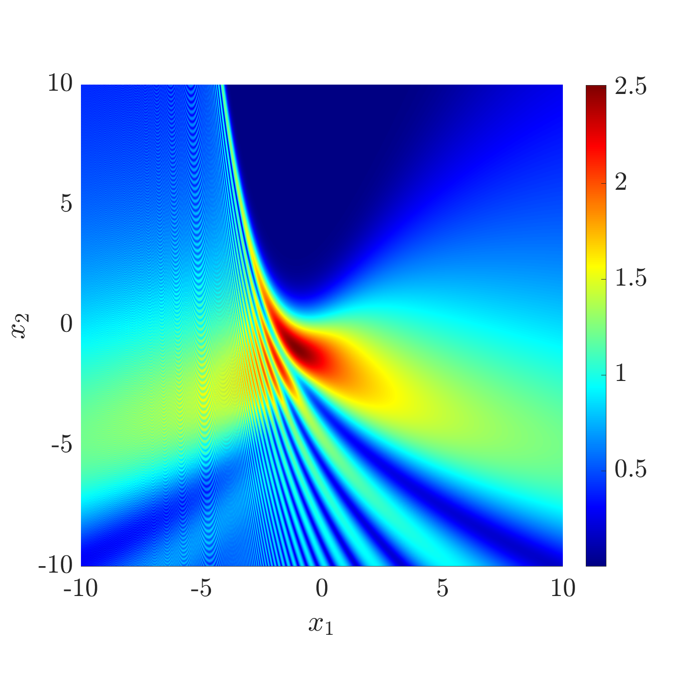
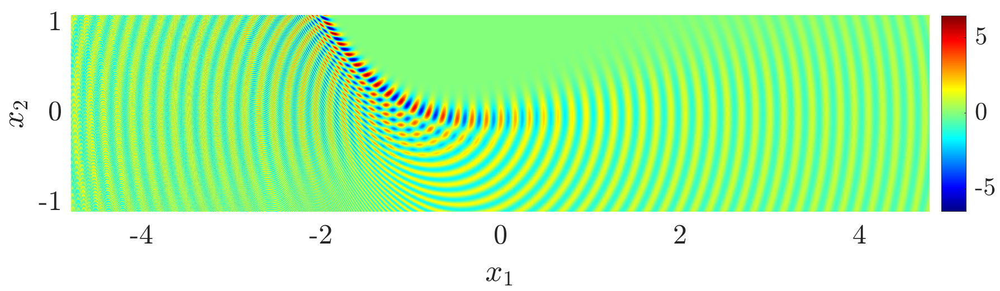

# Summary

Oscillatory integrals arise in models of a wide range of physical applications, from acoustics to quantum mechanics. `PathFinder` is a Matlab/Octave package for efficient evaluation of oscillatory integrals of the form
\begin{equation}\label{eq:I}
I = \int_a^b f(z) \exp(\mathrm{i}\omega g(z))~\mathrm{d}z,
\end{equation}
where the endpoints $a$ and $b$ can be complex-valued, even infinite; $\omega>0$ determines the angular frequency, $f(z)$ is a non-oscillatory entire function and $g(z)$ is a polynomial phase function. The syntax is simple:
```matlab
I = PathFinder(a, b, f, gCoeffs, omega, N);
```
Here, `f` is a function handle representing $f(z)$, `gCoeffs` is a vector of coefficients of $g(z)$, `omega` is the frequency parameter $\omega$ and `N` is a parameter that controls the degree of approximation.

`PathFinder` is the first black-box software that can evaluate \eqref{eq:I} accurately, robustly and efficiently for any $\omega>0$. It will be useful across many scientific disciplines, for problems that were previously too computationally expensive or too mathematically challenging to solve.

# Statement of need

Based on the method of Numerical Steepest Descent [@HuVa:06], `PathFinder` is an implementation of the algorithm described in @PathFinderPaper, where an earlier version of the code was used to produce numerical experiments. Since these experiments, much of the code has been rewritten in C, interfacing with Matlab/Octave via MEX (Matlab executable) functions. These are easily compiled using a single script.

### Ease of use

Standard quadrature rules (midpoint rule, Gauss quadrature, etc) are easy to use, and many open-source implementations are available. However, when applied to \eqref{eq:I}, such methods become prohibitively inefficient for large $\omega$.

On the other hand, several methods exist for the efficient evaluation of oscillatory (large $\omega$) integrals such as \eqref{eq:I}; a thorough review is given in @DeHuIs:18. However, applying these methods often requires an expert understanding of the process and a detailed analysis of the integral, making such methods inaccessible to non-mathematicians. Even with the necessary mathematical understanding, models may require hundreds or thousands of oscillatory integrals to be evaluated, making detailed analysis of each integral highly challenging or impossible.

Despite being based on complex mathematics, `PathFinder` can be easily used by non-mathematicians. The user must simply understand the definitions of the components of \eqref{eq:I}.

### Use in academic research

In many physical models, interesting physical phenomena occur in the presence of *coalescing saddle points* (see e.g. @PathFinderPaper for a definition). Examples include chemical reactions, rainbows, twinkling starlight, ultrasound pulses, and focusing of sunlight by rippling water [@DLMF, Section 36.14].

Coalescing saddle points can cause steepest descent methods to break down, even in simple cases where $g(z)$ is a cubic polynomial [@HuJuLe:19]. By design, `PathFinder` is robust for any number of coalescing saddle points. This is demonstrated in Figures \ref{fig:pearcey} and \ref{fig:swallowtail}, where `PathFinder` has been used to model well-known optics problems with coalescing saddle points. Specifically these are the *Cusp Catastrophe*
\begin{equation}\label{cusp}
\int_{-\infty}^{\infty}  \exp(\mathrm{i}(z^4+x_2z^2+x_1z))~\mathrm{d}z
\end{equation}
and the *Swallowtail*
\begin{equation*}
\int_{-\infty}^{\infty}  \exp(\mathrm{i}(z^5+x_3z^3+x_2z^2+x_1z))~\mathrm{d}z
\end{equation*}
respectively. More information about the physical significance of these integrals can be found in [@DLMF, Section 36.14]. In these plots, each point $(x_1,x_2)$ requires a separate evaluation of \eqref{eq:I} and thus a separate call to `PathFinder`. For example, for \eqref{cusp}, the following code was used for each $(x_1,x_2)$:
```matlab
PathFinder( pi, 0, ... % angles of valleys
            [], ... % no amplitude function
            [1 0 x2 x1 0],... % phase coeffs
            1, ... % frequncy parameter
            10, ... % number of quadrature points per contour
            'infcontour', [true true] % doubly infinite contour
            );
```

![PathFinder approximation to Pearcey/Cusp Catastrophe integrals [@Pe:46], which contain coalescing saddle points.\label{fig:pearcey}](../../examples/cusp.png){width=90%}

![PathFinder approximation to Swallowtail Catastrophe integrals [@Ar:81], which contain many coalescing saddle points.\label{fig:swallowtail}](../../examples/swallowtail.png)

In @HeOcSm:19 a new technique was described for the construction of integral solutions to the *Parabolic Wave Equation*, typically with coalescing saddle points. Plots of some solutions were provided using `cuspint` ([described below](#comparison-with-other-software)) in the cases that were "not too difficult", but others were excluded, for example, $A_{32}$ of equation (32) therein. This omission can now be easily produced using `PathFinder`, as shown in Figure \ref{fig:pwe}.

{width=80%}



The ideas of @HeOcSm:19 were combined with `PathFinder` in @OcTeHeGi:24 and applied to the famous (unsolved) inflection point problem of @Popov79. Via a simple change of variables, these solutions to the Parabolic Wave Equation could be transformed into meaningful solutions of the Helmholtz equation. Here `PathFinder` was used to visualise a wavefield with caustic behaviour close to a curve with an inflection point (as in Figure \ref{fig:inflection}) and provided numerical validation of the asymptotic approximations therein. In Figure \ref{fig:pwe}, the integral is
\begin{equation}\label{eq:ock}
\int_{\mathrm{e}^{\mathrm{i}9\pi/10}\infty}^{\mathrm{i}\infty} z\exp(\mathrm{i}(-x_2z^2-x_1z^4/2+2z^5/5))~\mathrm{d}z;
\end{equation}
this was subsequently transformed to a solution to the Helmholtz equation, in Figure \ref{fig:inflection}. The integrals \eqref{eq:ock} are evaluated using the following code:
```matlab
PathFinder( 9\pi/10, 1/2, ... % angles of valleys
            @(z) z, ... % no amplitude function
            [2/5 -x_1/2 0 -x_2 0 0],... % phase coeffs
            1, ... % frequncy parameter
            10, ... % number of quadrature points per contour
            'infcontour', [true true] % doubly infinite contour
            );
```

### Comparison with other software

To the best knowledge of the author, there are only a handful of other software packages which can efficiently evaluate oscillatory integrals. We now compare these to PathFinder.

### Mathematica's `NIntegrate`
- This is a built-in function of Wolfram Mathematica [@NIntegrate], based on the Levin method (see for e.g. [@DeHuIs:18, Section 3.3]).
- An advantage of Mathematica's `NIntegrate` is that the oscillatory component does not always need to be factored explicitly, and it can evaluate some oscillatory integrals where $g$ is non-polynomial.
- Based on experiments [@PathFinderPaper, Section 5.3], `NIntegrate` does not appear to have a frequency-independent cost for general polynomial phase functions.
- `NIntegrate` does not work in general for an unbounded contour with complex endpoints.
- `NIntegrate` is not open source; the code cannot be seen or modified, and one must acquire a license to use it. 

### `cuspint`
- This package is written in Fortran, based on the paper @KiCoHo:00.
- The `cuspint` package is somewhat similar to `PathFinder` in that it is also based on steepest descent contour deformation.
- The problem class is restricted to \eqref{eq:I} when $(a,b)=\mathbb{R}$. Therefore, it may be used to model the catastrophe integrals of Figures \ref{fig:pearcey} and \ref{fig:swallowtail}, but not those of Figure \ref{fig:pwe} and \ref{fig:inflection}.
- `cuspint` can experience "violent" exponential growth [@KiCoHo:00, Section 2], which can lead to inaccurate results. This is because, unlike `PathFinder`, it does not attempt a highly accurate approximation of the steepest descent contours.

### `Picard_Lefschetz_Integrator`

- This C++ package is also based on steepest descent. The key difference is the algorithm gradually deforms the contour, details are given in [@FePeTu:23].
- The scope of problems to which it is applicable appears broad, the full extent is unclear based on existing documentation. Like PathFinder, it can be applied to catastrophe integrals. There are examples where it is also applied to singular oscillatory integrals.
- To the best understanding of the PathFinder developers, it appears that user expertise is required to use `Picard_Lefschetz_Integrator`, various parameters must be tweaked to obtain accurate results, integrals must be manually truncated, etc. This is in contrast to PathFinder, which aims to be fully automated where possible, requiring minimal user input.

### `OscillatoryIntegralsODE.jl`

- This package is based on the Levin method (see for e.g. [@DeHuIs:18, Section 3.3]).
- This package can evaluate oscillatory integrals of the form
\begin{equation}
I = \int_a^bf(x) S(\omega x) \mathrm{d} x,
\end{equation}
when $S$ is a Bessel function [@DLMF, sec. 10.2], a Spherical Bessel function [@DLMF, sec. 10.47], or the Fourier oscillator $S(\omega x) = \mathrm{e}^{\mathrm{i}\omega x}$. The latter is clearly equivalent to \eqref{eq:I} when $g$ is a monomial, thus `OscillatoryIntegralsODE.jl` excludes the general case of PathFinder, where the high frequency oscillator has a polynomial phase function.

In summary, we believe that `PathFinder` is the only existing software package that can be applied in general to \eqref{eq:I}, without user expertise.

# Acknowledgments

I am very grateful for the guidance of Daan Huybrechs and David Hewett throughout the development of this software. I am also grateful for financial support from KU Leuven project C14/15/05 and EPSRC projects EP/S01375X/1, EP/V053868/1.

Some of the code in `PathFinder` is copied from other projects. I acknowledge @DAryo, used for the Dijkstra shortest path algorithm, originally proposed in [@dijkstra2022note]. I also acknowledge Dirk Laurie and Walter Gautschi for writing the code used for the Golub-Welsch algorithm, a full mathematical explanation of this algorithm can be found in [@gautschi2004orthogonal].

Finally, I must express my gratitude to the referees who gave their time to review the software and this paper. This paper, the code and its documentation were significantly improved as a result of the review process.

# References