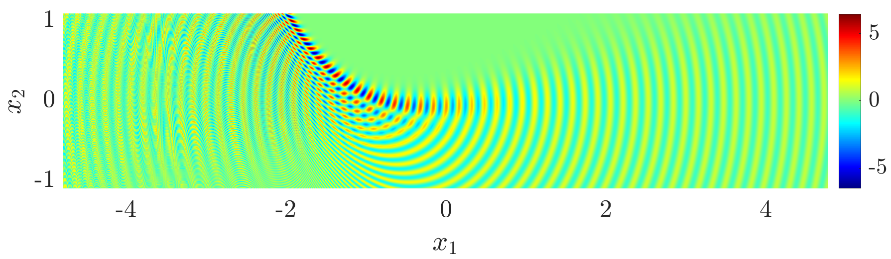

# Summary

Oscillatory integrals arise in models of a wide range of physical applications, from acoustics to quantum mechanics. `PathFinder` is a Matlab/Octave package for efficient evaluation of oscillatory integrals of the form
\begin{equation}\label{eq:I}
I = \int_a^b f(x) \exp(\mathrm{i}\omega g(x))~\mathrm{d}x,
\end{equation}
where the endpoints $a$ and $b$ can be complex-valued, even infinite; $\omega>0$ is the frequency parameter, $f$ is an entire function and $g$ is a polynomial phase function. The syntax is simple:
```matlab
I = PathFinder(a, b, f, gCoeffs, omega, N);
```
Here, `f` is a function handle representing $f(x)$, `gCoeffs` is a vector of coefficients of $g$, `omega` is the frequency parameter $\omega$ and `N` is a parameter that controls the degree of approximation.

`PathFinder` is the first black-box method that can evaluate \eqref{eq:I} accurately, robustly and efficiently for any frequency $\omega$. It will be useful across a range of scientific disciplines, for problems that were previously too computationally expensive or too mathematically challenging to solve.

# Statement of need

Based on the method of Numerical Steepest Descent [@HuVa:06], `PathFinder` is an implementation of the algorithm described in @PathFinderPaper, where an earlier version of the code was used to produce numerical experiments. Since these experiments, much of the code has been rewritten in C, interfacing with Matlab/Octave via MEX (Matlab executable) functions. These files can be easily compiled using a single script.

### Ease of use

Standard quadrature rules (midpoint rule, Gauss quadrature, etc) are easy to use, and many open-source implementations are available. However, when applied to \eqref{eq:I}, such methods become prohibitively inefficient for large $\omega$.

On the other hand, several methods exist for the efficient evaluation of oscillatory (large $\omega$) integrals such as \eqref{eq:I}, a thorough review is given in @DeHuIs:18. However, applying these methods often requires an expert understanding of the process and a detailed analysis of the integral, making such methods inaccessible to non-mathematicians. Even with the necessary mathematical understanding, models may require hundreds or thousands of oscillatory integrals to be evaluated, making detailed analysis of each integral highly challenging or impossible.

Despite being based on complex mathematics, `PathFinder` can be easily used by non-mathematicians. The user must simply understand the definitions of the components of \eqref{eq:I}.

### Use in academic research

We now describe an important problem class that can be easily modelled using `PathFinder`, and new research that has been stimulated as a result.

In many physical models, interesting physical phenomena occur in the presence of *coalescing saddle points*, (see e.g. @PathFinderPaper for a definition). Examples include chemical reactions, rainbows, twinkling starlight, ultrasound pulses, and focusing of sunlight by rippling water [@DLMF, 36.14].

Coalescing saddle points can cause steepest descent methods to break down, even in simple cases where $g$ is a cubic polynomial [@HuJuLe:19]. Fortunately, `PathFinder` is robust for any number of coalescing saddle points. This is demonstrated in Figures \ref{fig:pearcey} and \ref{fig:swallowtail}, where `PathFinder` has been used to model well-known optics problems with coalescing saddle points.

![PathFinder approximation to Pearcey/Cusp Catastrophe integrals [@Pe:46], which contain coalescing saddle points.\label{fig:pearcey}](../../examples/cusp.png){width=90%}

![PathFinder approximation to Swallowtail Catastrophe integrals [@Ar:81], which contain many coalescing saddle points.\label{fig:swallowtail}](../../examples/swallowtail.png)

In @HeOcSm:19 a new technique was described for the construction of integral solutions to the *Parabolic Wave Equation*, typically of the form \eqref{eq:I}. Via a simple change of variables, these solutions could be transformed into meaningful solutions of the Helmholtz equation. Plots of these solutions were provided using `cuspint` ([described below](#comparison-with-other-software)) in the cases that were "not too difficult", but some were excluded, for example, $A_{32}$ of equation (32) therein. This can now be easily produced using `PathFinder`, as shown in Figure \ref{fig:pwe}.

{width=80%}



The ideas of @HeOcSm:19 were combined with `PathFinder` in @OcTeHeGi:24 and applied to the famous (unsolved) Popov inflection point problem [@Popov79]. Here `PathFinder` was used to visualise a wavefield with caustic behaviour close to a curve with an inflection point (as in Figure \ref{fig:inflection}), and provided numerical validation of the asymptotic approximations therein.

### Comparison with other software

As was explained in @PathFinderPaper, to the author's best knowledge, the only other software packages that can efficiently evaluate oscillatory integrals are Mathematica's `NIntegrate` function, and the Fortan `cuspint` package of @KiCoHo:00. We now briefly compare these packages with `PathFinder`.

One advantage of Mathematica's `NIntegrate` is that the oscillatory component does not always need to be separated explicitly, as in \eqref{eq:I}. There are three drawbacks when compared to `PathFinder`:

- `NIntegrate` is not open source; the code cannot be seen or modified, and one must acquire a license to use it. 
- `NIntegrate` only appears to have a frequency-independent cost for monomial phase functions, i.e., $g(x)=x^\rho$ for $\rho\in\mathbb{N}$; a much narrower class than `PathFinder`, which can evaluate \eqref{eq:I} for any polynomial phase $g$. 
- It appears that `NIntegrate` requires the integration range to be finite, whereas `PathFinder` can evaluate integrals on an unbounded contour.

The `cuspint` package is similar to `PathFinder` in that it is also based on steepest descent contour deformation. There are two drawbacks when compared with PathFinder:

- The problem class is restricted to \eqref{eq:I} when $[a,b]=\mathbb{R}$. Therefore, it may be used to model the catastrophe integrals of Figures \ref{fig:pearcey} and \ref{fig:swallowtail}.
- `cuspint` can experience "violent" [@KiCoHo:00,\S2] exponential growth in certain regions of the complex plane, which can lead to inaccurate results. This is because, unlike `PathFinder`, it does not attempt a highly accurate approximation of the steepest descent contours.

In summary, `PathFinder` is the only software package that can be applied in general to \eqref{eq:I} when $a$ and/or $b$ are infinite and complex, as in the problems visualised in Figures \ref{fig:pwe}-\ref{fig:inflection}.

# Acknowledgments

I am very grateful for the guidance of Daan Huybrechs and David Hewett throughout the development of this software. I am also grateful for financial support from KU Leuven project C14/15/05 and EPSRC projects EP/S01375X/1, EP/V053868/1.

Some of the code in `PathFinder` relies on other projects. I am grateful to Dimas Aryo whose code is used for the Dijkstra shortest path algorithm. I am also grateful to Dirk Laurie and Walter Gautschi for writing the Golub-Welsch algorithm used to generate Gaussian quadrature rules.

# References